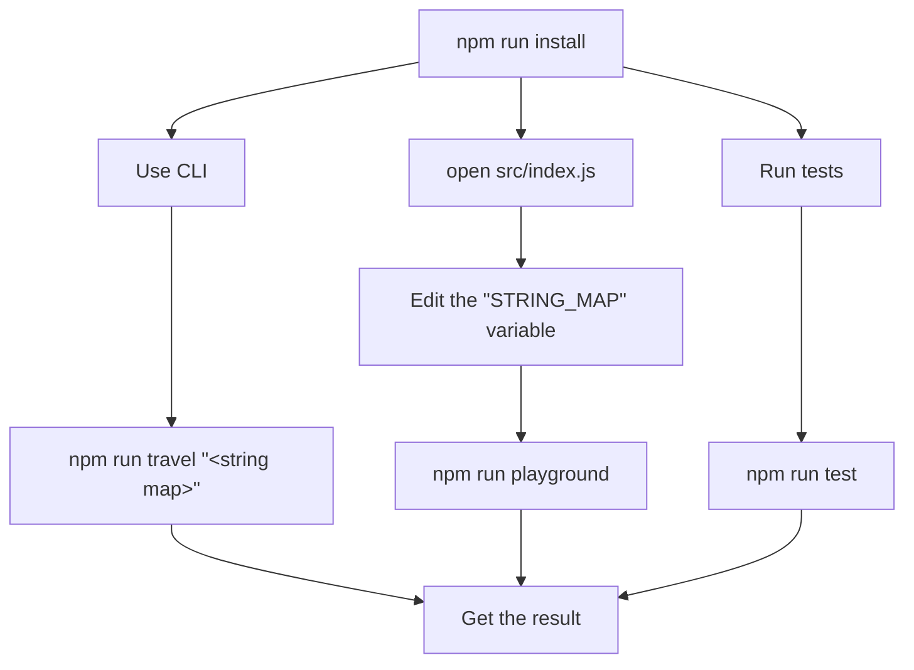

This is a solution to a code challenge from the "Software Sauna" company.

Here is the [original task](https://github.com/softwaresauna/code-challenge/blob/ba1340569178b36d3d16115dfd8a80baba391994/README.md).

## How to use

## Techstack

- node `v22.14.0`
- Javascript
- JSDoc
- Jest
